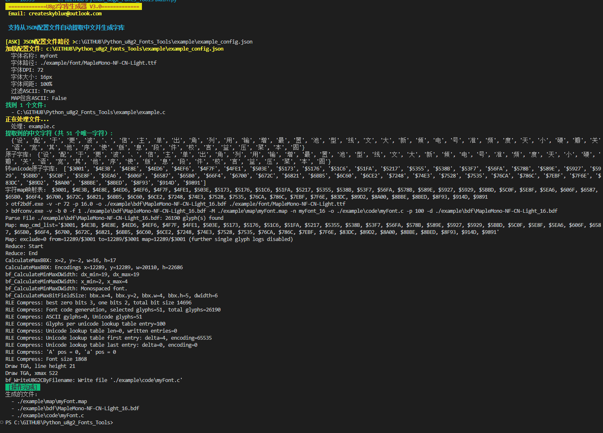

# Easy U8g2 Font Generate Tools

**专为 U8g2 图形库打造的中文字库自动生成工具**，可从 C/C++ 源代码中智能提取中文字符，自动生成适用于嵌入式开发的定制化字库文件。

## 📖 项目简介

本工具致力于解决嵌入式开发中使用 U8g2 显示中文时的字库生成难题。通过扫描项目源代码自动提取所需中文字符，结合自定义 TTF 字体文件，一键生成 U8g2 可直接使用的 C 语言字库代码，大幅提升开发效率。

### 核心特性

- **智能字符提取**：自动从 C/C++ 源代码中提取所有中文字符，包括汉字和中文标点符号
- **智能预处理**：自动识别并去除 C/C++ 注释（// 和 /* */），确保只提取有效文本
- **灵活的文件匹配**：支持单文件、目录递归、通配符模式多种方式指定源代码
- **多编码支持**：自动尝试 UTF-8、GBK、GB2312、UTF-16 编码，兼容不同项目
- **完全定制化**：支持自定义字体、大小、DPI、字间距等所有参数
- **智能字符过滤**：可选择过滤 ASCII 字符，生成纯中文字库以节省存储空间
- **一键生成**：自动生成 .map 字符映射、.bdf 字体文件、.c 字库代码三套完整文件

### 适用场景

- 使用 U8g2 图形库的嵌入式项目需要显示中文
- MCU 存储/Flash 空间有限，需要精确控制字库大小
- 项目中有大量中文菜单、提示信息需要字库支持
- 需要使用自定义字体风格的项目

## ✨ 新功能 (V3.0)

- [x] **JSON配置文件支持** - 所有参数通过配置文件设置，无需交互式输入
- [x] **自动提取中文** - 从C/C++源代码文件中自动提取中文字符
- [x] **自动去除注释** - 预处理阶段自动移除C/C++注释
- [x] **多文件批量处理** - 支持文件、目录、通配符模式
- [x] **多编码支持** - 自动尝试utf-8、gbk、gb2312、utf-16编码
- [x] **命令行参数支持** - 可直接指定配置文件路径

## 📋 实现功能

- [x] 自定义文本或从源代码提取
- [x] 文本自动去重
- [x] ASCII字符可选过滤
- [x] 自定义TTF字体
- [x] 自定义字体大小和DPI
- [x] 字间距调整
- [x] JSON配置文件

## 🚀 快速开始

### 1. 准备配置文件

创建或编辑 `config.json` 配置文件：

```json
{
  "font_name": "myFont",
  "font_path": "./example/font/MapleMono-NF-CN-Light.ttf",
  "font_dpi": 72,
  "font_size_px": 16,
  "font_spacing_percent": 100,
  "filter_ascii": true,
  "map_include_ascii": false,
  "output_dir": "./example",
  "file_paths": [
    "./example/*.c"
  ]
}
```

### 2. 运行程序

```bash
python main.py config.json
```

或直接运行后输入配置文件路径：

```bash
python main.py
```

### 3. 查看输出

程序会在以下目录生成文件：
- `./example/map/` - 字符映射文件 (.map)
- `./example/bdf/` - BDF字体文件 (.bdf)
- `./example/code/` - C语言字库代码 (.c)

## 📝 配置参数说明

| 参数 | 类型 | 必填 | 说明 |
|------|------|------|------|
| `font_name` | string | ✅ | 生成的字库名称 |
| `font_path` | string | ✅ | TTF字体文件路径 |
| `font_dpi` | int | ✅ | 字体DPI值 |
| `font_size_px` | int | ✅ | 字体大小（像素） |
| `font_spacing_percent` | int | ✅ | 字体间距（百分比） |
| `filter_ascii` | bool | ❌ | 是否过滤ASCII字符（默认true） |
| `map_include_ascii` | bool | ❌ | MAP映射文件是否包含ASCII（默认false） |
| `output_dir` | string | ❌ | 输出目录（可选，默认为当前目录子目录） |
| `file_paths` | array | ✅ | 需要处理的文件路径列表 |

### file_paths 支持的格式

- **单个文件**: `"code/main_font_9.c"`
- **整个目录**: `"code/"` - 递归处理所有.c/.cpp/.h/.hpp文件
- **通配符**: `"**/*.h"` - 当前目录及子目录下所有.h文件
- **混合使用**: 同时支持多种格式

## 📸 运行示例



## 🔧 工作流程

1. **读取配置** - 从JSON配置文件加载所有参数
2. **文件扫描** - 根据`file_paths`配置扫描所有目标文件
3. **预处理** - 读取文件并去除所有C/C++注释
4. **中文提取** - 从预处理后的代码中提取中文字符
5. **字符去重** - 对提取的字符进行去重处理
6. **生成MAP** - 创建字符映射文件
7. **生成BDF** - 使用otf2bdf生成BDF字体文件
8. **生成代码** - 使用bdfconv生成C语言字库代码

## 📄 开源协议

main.py 适用于 GPL3.0 协议

## 🔗 第三方工具

| 名称 | 来源 |
| :----: | :----:  |
| bdfconv | [https://github.com/olikraus/u8g2](https://github.com/olikraus/u8g2) |
| otf2bdf | [http://sofia.nmsu.edu/~mleisher/Software/otf2bdf/](http://sofia.nmsu.edu/~mleisher/Software/otf2bdf/)

## 💡 使用提示

1. 确保 `bdfconv.exe` 和 `otf2bdf.exe` 与 `main.py` 在同一目录
2. 字体文件路径可以是相对路径或绝对路径
3. 支持的源代码编码：UTF-8、GBK、GB2312、UTF-16
4. 如果遇到编码问题，程序会自动尝试其他编码格式

## 📞 联系方式

Email: createskyblue@outlook.com
